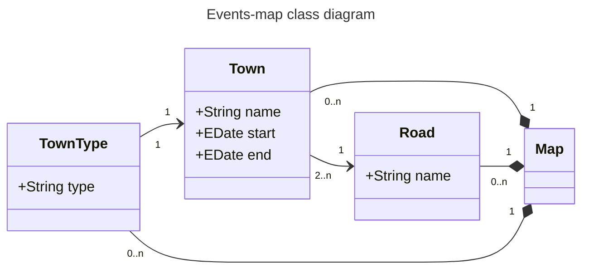

You can read Russian version [at this page](RUREADME.md).

# Yarocvet

There is site for participants of one schooler action, named Yarocvet. Action represents big chain of events for anyone, who is associated with school, but first of all – for schoolers. 
> [!TIP]
> You can looking for code, but not edit. This project closed for editing, because must do serious work all time. If you want effect to Yarocvet, please create issue or pull request. 

This document aimed to holders the Yarocvet project server. There are some instructions and recommend ways to suppliment site content.

> [!CAUTION]
> This repository and content here, including technical side of this site, created by @AParovyshnaya. Sometimes repository owner needed commit from @eparovyshnaya machine. Read more at this issue (#1). 

System support easy editing events for server holders by JSON. More read down.

## Events-map

> [!NOTE]
> This function have not realising full for now. It's paragraph mostly about plans.

Events-map is page block, which collect Yarocvet events into "map". Newly user can find out any information by one look.

### What is it

It look likes geographical map with "towns". Towns are events at real meaning. Graphicaly, they are points with names and can be clicked for further information. Some towns coupled by the "roads", if events are parts of cource.

Look at this diagram:

Graphical properties, like coordinates, color, shape, get information about real properties of central objects of scheme. They calculates automaticly.

### How put new Event 
comming soon... :smirk:

Also you would see, how create data files, what is EMF (and why Yarocvet repository have so much Java code) and how automatisate the process. Bonus: how Yarocvet make from data graphical element?

This content wil be avalibale, when events-map will be done.
